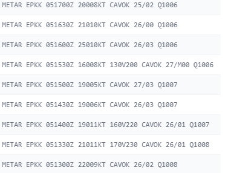
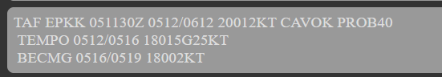
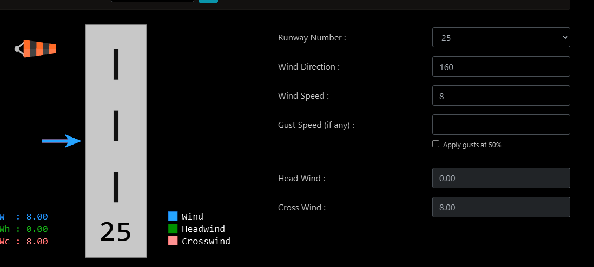
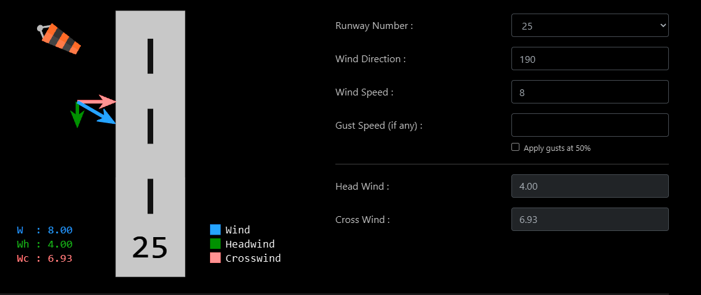
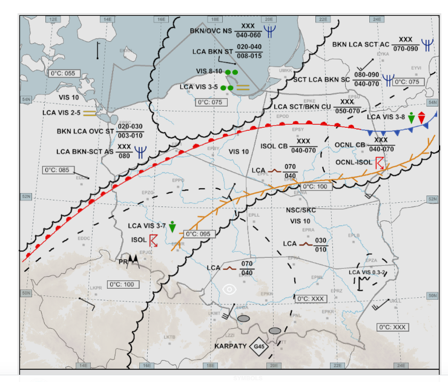
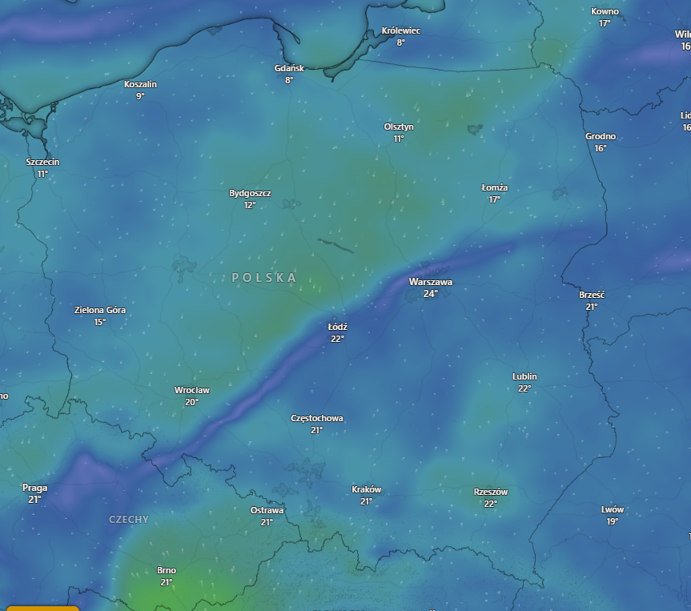

bardziej zapis mojej rozmowy z Szymonem n.t. wyboru pasa w użyciu w krakowie, gdy wiatr był 160/8

i tez zrodziło mi sie pytanie dotyczace zmiany pasa
mialem sytuacje ze ostatni metar wskoczyl mi 160 stopni 8 wezlow a mialem pas 25
a taf tego nie pokazywal jak to taf
i w takim razie gdyby wzrosl powyzej tych 10kts to nie wiem jak sie zachowac
czy zmieniac odrazu? albo czekac na nastepny metar?
jesli taf to taka wrozba xD

oraz jeszcze pytanko dotyczace ogloszenia zmiany pasa - wiem ze nalezy skoordynowac to wyzej i z wyprzedzeniem (tez ciezko mi okreslic tak naprawde jaka i kiedy bedzie szansa ze bede musial zmienic pas?) ale jak przekazac to pilotom? zbiorczo?

---

szukalem stronki z archiwum TAF, ale jakas podejrzana sie znalazla 😄 teoretycznie pokazywalo ze jest szansa 40% na okresowy wiatr z poludnia i porywy
teraz zobacz ze ten co miales, czyli 160/8 to jest crosswind
a do wyboru pasa aktywnego bierzesz skladowa tailwind/headwind, są na to kalkulatory jesli nie chcesz samemu sie babrać w cosinusy xD na przyklad [https://e6bx.com/wind-components/](https://e6bx.com/wind-components/)

160stopni to idealnie z boku, jak wpiszesz inne to fajnie na skladowe rozbija

i teraz zostawienie pasa 25 bylo jak najbardziej sluszne, bo jak spojrzysz na historie metarow, to sie trzymal wiatr od zachodu, nie bylo tendencji do obrotu na wschodni, chwilowo tylko mial jeden "epizod" południowy

ja bym czekal na kolejne metary, jesli by bylo tak ze by sie zmienial kolejno 160/8 -> 110/7 -> 090/9 itp, to widac ze sie odwraca i mozna zmieniac pas
jest tez inna mapka pogodowa - nazywa sie SIGWX - significant weather chart, to juz troche wyzsza szkola jazdy ale z tego tez korzystamy zeby zobaczyc jak sie jakies fronty, nize czy wyże zachowuja, bo z tego tez mozna wyczytac jaki bedzie wiatr za jakis czas
ale z reguly TAF sie bardzo fajnie sprawdza

tu np widac ze przez polnocna polske przechodzi front cieply + linia konwergencji przez wroclaw/warszawe/terespol - ta zolta linia, a takie zjawiska tez ksztaltuja wiatr
https://awiacja.imgw.pl/prognozy-lotnicze/sigwx

fajnie to tez widac na przyklad na windy.com, zwlaszcza linia konwergencji gdzie w zasadzie wiatru nie ma, a po drugiej stronie jest jzu w druga strone

(choc bez animacji troche trundo na screenie zobaczyc gdzie w ktora strone wieje)
anyway, patrzysz na skladowa tylna wiatru, jak dochodzi do 5kts + stala tendencja a nie chwilowe wachniecie, to bym juz myslał o zmianie

i teraz tu sie wlasnie bardzo TAF przydaje - o ile nie pokazuje dokladnie co bedzie, to widzisz czy za 1-2h bedzie wialo w druga strone, czy tylko jakies chwilowe zawirowania sie w metarze pojawily. Wiec wszelkie TEMPO mowia nam o mozliwych odchyłkach, wszelkie BECMG o trwałych zmianach, wiec warto na to zwracac uwage
w tych TAF z dzis co znalazlem jest wlasnie TEMPO 0512/0516 18015G25
czyli okresowo (konkretnie znaczy to "nie wiecej niz polowa podawanego przedzialu, czyli nie wiecej niz 2h z 4h pomiedzy 12-16") wiatr moze sie zmienic na 180st. A do tego jest tam tez PROB40, wiec jest na to szansa, ale moze nie wystapic ta odchyłka
i to wszystko mowi nam ze to 
1) okresowe zjawisko
2) moze wcale sie nie pojawic
3) nadal generuje tylko wiatr z boku, a nie wiatr w plecy

Mi przez 2 lata kontrolowania na VS zdarzyło sie zmienic pas moze z 2 razy 😄 Ale pilotom wszystkim trzeba powiedziec indywidualnie, bo jak zmieniasz pas to kazdy musi dostac nowe zezwolenie z nowym SID

tzn mozesz zbiorczo oglosic "all stations, rwy in use is now 07", a potem do kazdego i tak trzeba zagadac ze "recleared, babko4F departure, rest of clearance unchanged/the same"
warto z pilotami tez zagadac, np. "current wind is 100/8kts, do you prefer 07 or 25 for departure?"
jak ktos byl zbriefowany do 25 i stoi na A, to jest duza szansa ze juz z tego 25 bedzie wolal poleciec
wtedy tez z APP koordynujac mowisz ze zmieniasz pas, ale ten ten i ten jeszcze z 25 odleca
jesli app nie ma, a masz jakies w miare blisko przyloty, to ja np. pisalem do pilotow prywatne wiadomosci zeby dac znac ze pas zmienilem, zeby tam sobie przeklikali w komputerze a nie wpadali na pełnej pod prąd 😄 a i tak sie zdarzało, to wtedy trzeba czekac na takiego jegomościa az wyladuje i dopiero wznowic odloty