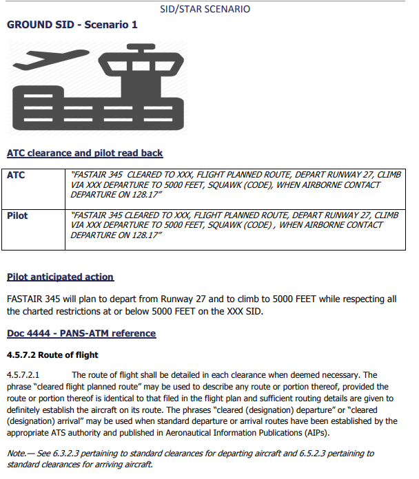

Mieliśmy wczoraj rozmowę o tym jak wydawać zezwolenia na lot, tzn czy poprawna jest formułka ```depature babko4f runway 07, climb initially 6000ft```. Otóż była, jakoś do 2016 roku. Wobec wzrostu ruchu i coraz większego complexity procedur SID/STAR mających ten ruch kanalizować, coraz częściej dochodziło do nieporozumień między pilotami a atc w kwestii tego, jak procedury te należy wykonać. Rozchodziło się głównie o frazeologię dotyczącą przestrzegania/zwolnienia z przestrzegania restrykcji wysokości i prędkości. ICAO, rozpoznając rosnący problem, powołało grupę roboczą która miała go rozwiązać przez opracowanie nowej, bardziej precyzyjnej i zdefiniowanej frazeologii. Efektem były zmiany wprowadzone właśnie w 2016 roku, które podsumowane są tutaj

https://skybrary.aero/sites/default/files/bookshelf/3586.pdf

Nas, z perspektywy kontrolera wieżowego, obchodzi przede wszystkim fragment dot. instrukcji SID (Choć mam wielką nadzieję, że wszyscy będziecie w niedalekiej przeszłości szkoląc się na S3 rozważać ten problem też z perspektywy kontrolera zbliżania🤞) Rzućcie okiem na stronę 29: 



poprawnie będzie więc np.

```climb via POBOK5J departure altitude 6000ft```

Dokument określa też różne możliwe warianty anulowania restrykcji, ale na S2 nas to na razie nie interesuje. Dodatkowo ucina dyskusję na temat tego, czy należy podawać początkowe wznoszenie, jeśli jest ono podane na mapie - jako dobra praktyka podawałbym zawsze (bez względu na publikację wartości na mapie, czy obecności lub braku APP nad Wami).

Jak to wygląda w praktyce? Pewnie często będziecie się spotykać z używaniem starej formułki. Pewnie też w większości przypadków będzie to skutkować poprawnym wykonaniem procedury wbitej w FMC. Niemniej jednak jeśli zastanawiacie się, jaka jest aktualnie obowiązująca wersja, to jest ona jak na załączonym obrazku. Powyższy link jest tylko opracowaniem, obowiązujące nas przepisy znajdziecie w core: Doc 4444 -  strony 135, 267