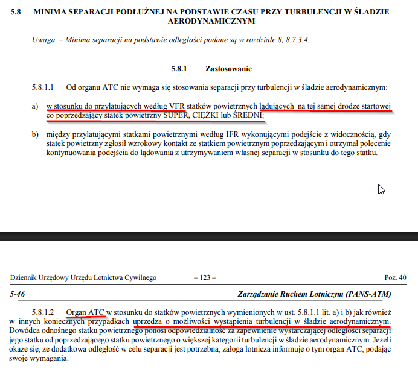
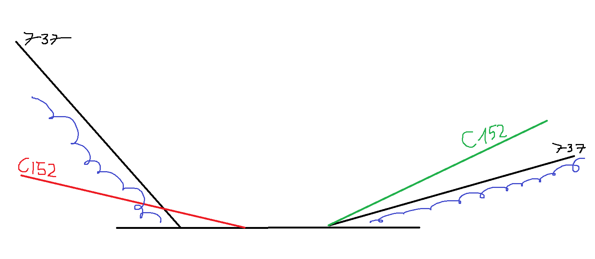
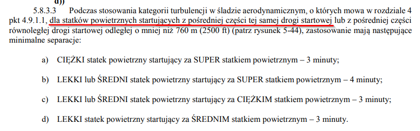

Czesc, tym razem o separacji z turbulencją w śladzie słów kilka

Obserwowaliśmy z Bartkiem wczoraj egzamin Igora i kilka razy padło znane Wam zapewne "wykonuj z uwagą na turbulencję w śladzie, poprzednik kategoria średni". Sytuacja była jednak taka, że informację dostawał VFR będący numerem 1 w kolejce, a ruchem medium był odlatujący 737. Nie jest to poprawne zastosowanie tej formułki, doszliśmy w związku z tym do wniosku, że warto przypomnieć jak i kiedy można przerzucać odpowiedzialność separowania się z wake turbulence na pilota, może komuś się przyda.

Zgodnie z 4444 odpowiedzialność na zachowanie separacji z turbulencją w śladzie aerodynamicznym można zrzucić na pilota tylko dla **dolatujących** VFRów - "przylatujących VFR (...) lądujących na tej samej drodze startowej, co poprzedzający M/H/J" Separacja dla **odlatujących** statków powietrznych leży juz wyłącznie w gestii kontrolera.

Uzasadnienie tego jest takie:

1) wiry turbulencji w śladzie mają tendencję do [opadania za generującym je samolotem](https://www.youtube.com/watch?v=BaRb46vv_bQ&t=13s)
2) VFR na podejściu z reguły bez problemu moze podejść stromiej, niż standardowa ścieżka 3st ktorą mamy na większosci podejść instrumentalnych. W związku z tym pilot unika wake utrzymując się ponad torem lotu poprzednika, nadal będąc na swojej nominalnej, ale stromszej ścieżce podejścia końcowego.
3) w przypadku odlotów taki 737 wznosi się bardzo szybko po starcie. Cessna zdecydowanie wolniej, jeśli więc będą lecieć tą samą trasą, to cessna na pewno przetnie wake poprzednika. Leci wolno i nisko i ma bardzo ograniczone możliwości manewrowania. Tu już nie ma ułatwień, o separację z turbulencją w śladzie musi zadbać kontroler.
   
Teraz będzie bardzo pro ilustracja :D

Teraz warto się przyjrzeć, co takie podejście sprawia kiedy nasza Cessna robi konwojera za odlatującym 737. Przyziemia daleko za progiem, toczy się chwilę, potem maksymalna moc i startuje. Zjadła w tym czasie kilkaset metrów pasa, więc jej odlot należy traktować jak start z pośredniego dystansu W związku z tym to kontroler powinien zadbać o zapewnienie 3 minut separacji za odlatującym M/H, tu już niestety "wykonuj z uwagą na turbulencję" nie działa

